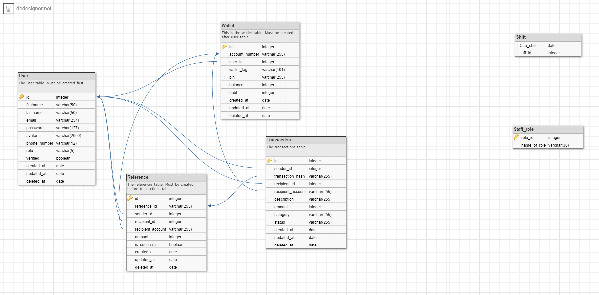

-   Application Name: demo-credit
-   Start Date: January 2nd, 2023

# About

Demo Credit is a mobile lending app that features a wallet functionality. Borrowers can use their wallet to receive the loans they have been granted and also send the money for repayments.

# Summary

[summary]: #summary

Demo Credit is a mobile lending app that requires wallet functionality. This is needed as borrowers need a wallet to receive the loans they have been granted and also send the money for repayments.

This proposes an MVP (Minimum viable product) wallet service:

1. A user can create an account
2. A user can fund their account
3. A user can transfer funds to another user’s account
4. A user can withdraw funds from their account.

## Backend setup

-   Clone this repo `git clone https://github.com/khomohzie/demo-credit.git`
-   Install dependencies `yarn`
-   Create `.env` with your values. Check `.env.sample` for more information.
-   Run MySQL server.
-   Run Redis server locally. You can also configure it to use cloud. To use cloud, use `process.env.NODE_ENV === 'production'` or refer to [redis configuration](#redis-configuration) for more information.
-   Migrate the database `npm run migrate`.
-   Run seed files `npm run seed` (optional for development but necessary to run tests).
-   Start server with `yarn run dev` or `npm run dev`
-   Server will be running on http://localhost:4000 or otherwise as configured in your `.env` file.

## E-R Diagram

https://dbdesigner.page.link/vQmhAkVMzdGntF558



## Edit configurations (Optional)

### Knex configuration

-   Path to knex configuration - `src/config/knex.config.ts`
-   To create migration file `npx knex migrate:make <file-name> --knexfile ./src/config/knex.config.ts`
-   To run migration `npm run migrate`
-   To rollback migration `npm run rollback`
-   To run seedfiles `npm run seed`

*   Note: You do not need to edit the `src/config/db.ts` file. You may only refer to it for understanding.
*   Migrations and seeds are saved in `src/db/migrations` and `src/db/seeds` respectively.

### Redis configuration

[redis configuration]: #redis-configuration

If you so desire to change the default configuration for the various environments e.g development to use cloud redis instead, refer to `src/utils/redis.util.ts` file and change:

```js
const redisClient: redis.RedisClientType =
	process.env.NODE_ENV === "development"
		? redis.createClient()
		: process.env.NODE_ENV === "test"
		? redis.createClient()
		: redis.createClient({ url: process.env.REDIS_URL });
```

to

```js
const redisClient: redis.RedisClientType =
	process.env.NODE_ENV === "development"
		? redis.createClient({ url: process.env.REDIS_URL })
		: process.env.NODE_ENV === "test"
		? redis.createClient()
		: redis.createClient({ url: process.env.REDIS_URL });
```

### Tests

Before running tests, ensure the following:

1. `NODE_ENV=test` is present in your environment variables. Change from `development` or `production` to `test`.
2. Redis is started and running locally or on the cloud. If using cloud, refer to [redis configuration](#redis-configuration) to edit the configuration for test environments.

```bash
  npm run test
```

-   Note: I specified the order of test files in the `__tests__/index.test.ts` file. All other `*.test.ts` files are ignored except `start.test.ts`. This is because succeeding tests need preceding tests to pass.

### Error codes

1.  -   code: ACC_ERR_01
    -   alias: acc_not_found
    -   reason: account not found
2.  -   code: ACC_ERR_02
    -   alias: acc_not_verified
    -   reason: account not verified

3.  -   code: ACC_ERR_03
    -   alias: acc_not_admin
    -   reason: account not admin

4.  -   code: ACC_ERR_05
    -   alias: wall_not_found
    -   reason: id not associated with any wallet
